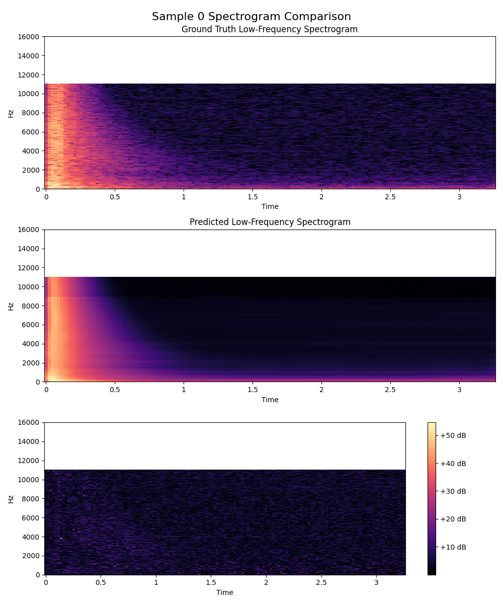

# BassNet
BassNet is an exploratory deep learning project designed to tackle a unique acoustic challenge: Can we reconstruct the missing low-frequency portion of an audio signal using only its high-frequency components?

This project explores the multiple potential solutions to this problem, we keep record of each experiment for future reference.

## Experiment 0 

### Dataset
RIR data (rir.wav) alone in [Real-Acoustic-Field dataset](https://github.com/facebookresearch/real-acoustic-fields/)

### Data Preprocessing
We turned the .wav files to spectrograms, then divided the spectrum into high frequency and low frequency regions at a frequency of 16kHz.
We used high-frequency part as the input, and low-frequency part as the output.

### Model
A classic U-Net architecture implemented from scratch.

### Training configs
Batch size: 16

Epoch: 25

Learning rate: 1e-4

### Result

The Average MSE on test dataset is 24.5, which means on average, our model's prediction at any (time, frequency) point will deviate from the true value by ~5 dB. This is a good start as using RIR alone to train the model.